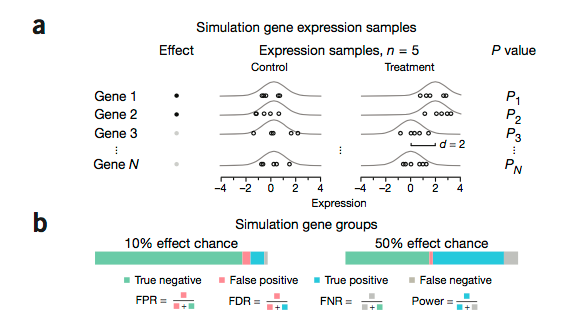
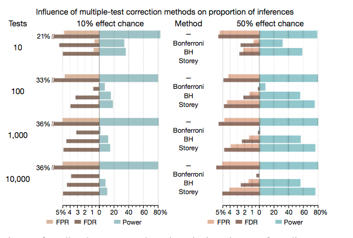

>When a large number of tests are performed, P values must be interpreted differently.

之前我其实一直没有太理解为什么要有一个多重检验的过程，通过这篇总算有了一些了解，至少知道了，对于同时做多个检验的必要性。

文中用了一个例子，假设我们检测N=10000个基因的表达，然后我们使用的检测方法的power=80%，`a=0.05`，真实的阳性基因只占所有基因的10%，也就是effect chance=10%。

这样计算下来

$TP（True Positive）=10000 * 10\% * 80\% = 800$
$FP（False Positive）= 10000 * (1-10\%) * 0.05 = 450$
$TN（True Negative）= 10000 * (1-10\%) *(1-0.05) = 8550$
$FP（False Negative）= 10000 * 10\% * (1-80\%) = 200$

这样一计算，一共检测出来1250个阳性基因，就有450个基因是假阳的。倘若effect chance只有1%，那么检测出来575个阳性基因，其中495个都是假阳性。所以这样如果还不进行后续的多重矫正，**错误的结果将造成严重的后果**。

## 多种检验 ##

- 设计了一种测试，effect chance分别是1%和5%，而且effect size(d)=2，`a=0.05`，power=80%，然后N=10,100,1000,10000，分别做100次测试，最终获得结果如下图：

$$FPR=\frac{FP}{FP+TN}$$
$$FDR=\frac{FP}{FP+TP}$$

从图中可以看出对于effect chance为10%的时候，FDR在未经过矫正的情况下会特别的高（>20%），而经过矫正后又会大大的影响power，但从效果上来讲（Bonferroni < BH < Storey），当然这要研究的目的挂钩，如果本身有很多的阳性，那么可能需使用Bonferroni来降低假阳性，而本身阳性很少，那可能要用Storey来保证Power。

对于effect chance=50%是同样的，不过效果要好很多。

>Now, instead of identifying two genes at N = 10,000 and effect rate 10% with Bonferroni, we find 88 and are wrong only four times.

## 多种检验的方法 ##

### Bonferroni ###

- 这种方法比较简单，就是用原始的p值*样本数目，以之前的例子，假设某个基因的p值为0.0001，经过矫正后的p值就是0.0001*10000 = 1，也就是变得很不显著，这种方法会大大的降低power
- 不过有一种bonferroni的变形，他不是所有的p值都乘以样本数目，而是先讲p值进行排序，然后乘以他们的排序值（从小到大），例如3个p值为 0.001 0.003 0.04，经过矫正后他们的p值就变成了 0.001,0.006,0.12，这种方法要比传统的bonferroni要好一些，对power的影响小一些。

### BH ###

>这个方法跟Holm方法很像，也是先排序，但之后p值并不是简单的乘排序，而是乘检验总数后除排序.举例来说就是假设三次多重检验的p值分别是0.01、0.03与0.06，其调节后的p值为0.03，0.45，0.06。那么为什么说这种方法控制的是错误发现率呢？我们来看下αα是如何得到的：p值乘总数m得到的是在该p值下理论发现数，而除以其排序实际是该p值下实际发现数，理论发现数基于在这里的分布是均匀分布，也就是空假设的分布，这两个的比值自然就是错误发现率。

这个BH原理还是没有太明白，还是需要在研究一下。

### Storey ###

$\pi_{0}=\frac{\#\{p_{i}>\lambda\}}{(1-\lambda)m}$

详细的也没太明白。不过这个就是计算q值的。

>Storey’s method first estimates the fraction of comparisons for which the null is true, p0, by counting the number of P values larger than a cutoff \lambda (such as 0.5) relative to (1 – \lambda)N (such as N/2), the count expected when the distribution is uniform. If R discoveries are observed, about aNp0 are expected to be false positives, and FDR can be estimated by aN\pi0/R.

